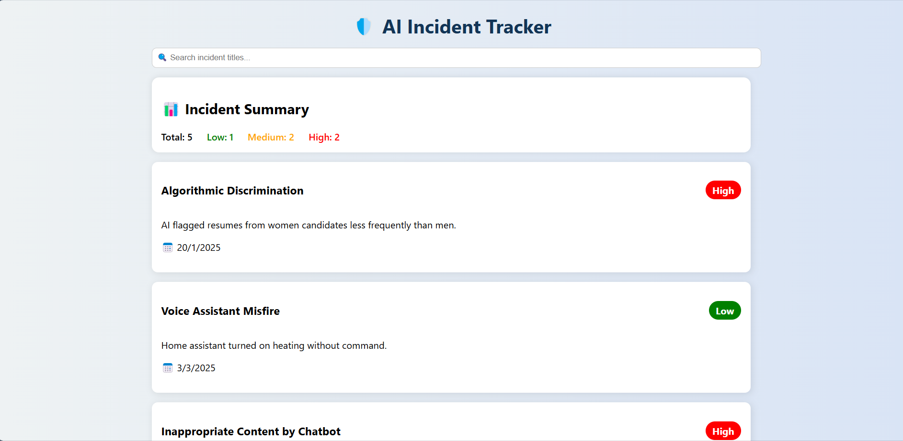
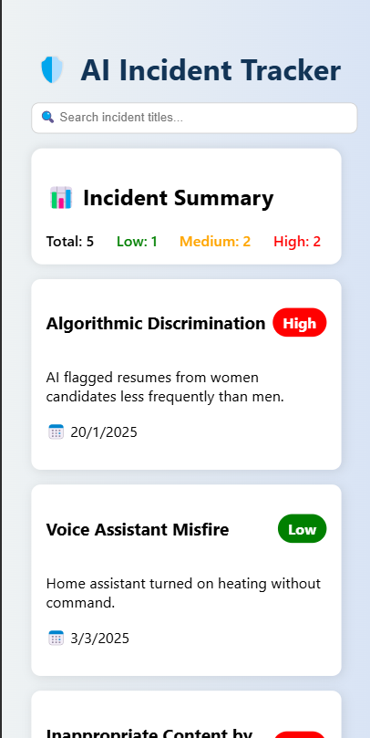

# 🤖 AI Safety Incident Dashboard

A visually engaging and functional React + TypeScript dashboard that tracks real-world AI safety incidents. Built with a modern UI, useful insights, and smooth user interactions. Ideal for AI startups, internal tools, or public reporting platforms.

---

## 🌟 Features

- 🔍 **Live Search** by title
- 📊 **Severity Summary** (Low, Medium, High)
- 🆕 **Add New Incident** (with real-time date)
- 🎨 **Modern UI** with gradients, shadows, and responsive layout
- 🧠 **Clean, modular components** in TypeScript
- 📅 Date formatted for readability
- 📱 Fully responsive design

---

## 📸 Screenshots

> Replace below images with your own if needed

### 💻 Laptop View


### 📱 Mobile View


---

## 🛠️ Tech Stack

- **React** with **TypeScript**
- CSS (custom styled, no external UI libraries)
- Functional Components & Hooks
- Modular File Structure

---

## 🚀 Getting Started

### 1️⃣ Clone and Install

```bash
git clone https://github.com/your-username/ai-safety-dashboard.git
cd ai-safety-dashboard
npm install
